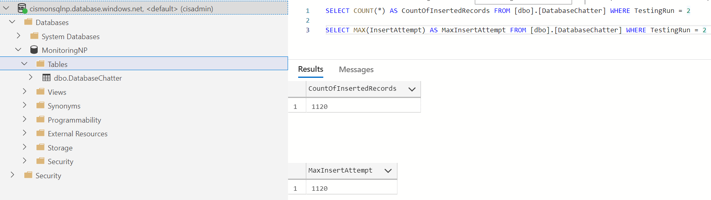
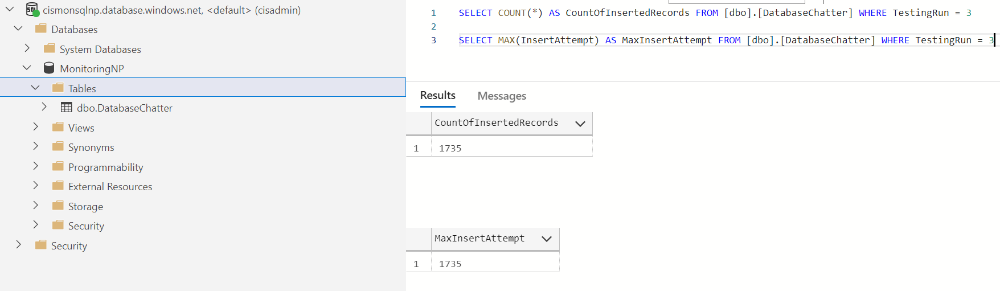

# sql-db-chatter

The sql-db-chatter application is an application that can be run against a SQL Server as configuration changes are made to SQL Server to test connectivity and ensure that the configuration changes being performed do not cuase downtime or errors in record insertion.

## Previous Usages

This application was used to test the Deployment and Destruction of the Azure SQL Server Event Auditing feature for [cismonsqlnp](https://portal.azure.com/#@kproductivity.onmicrosoft.com/resource/subscriptions/8fb80aa4-37b2-499a-917d-fbd780403a51/resourceGroups/rg1021QRsqlNP/providers/Microsoft.Sql/servers/cismonsqlnp/overview) ([cismonsql](https://portal.azure.com/#@kproductivity.onmicrosoft.com/resource/subscriptions/9e528e29-2e22-4da0-8f4e-bd4b4fdfdc6f/resourceGroups/rg1021QRsql/providers/Microsoft.Sql/servers/cismonsql/overview) in Production).

### cismonsqlnp Testing Results

The following logs show that no Errors were encountered during both the deployment and destruction of the Event Auditing configuration:

- [Deploy](sql-db-chatter.cismonsqlnp.deploy-auditing.log): TestingRun 2 ended at 9/15/2021 8:03:59 PM (UTC) after attempting to insert 1120 records with 0 errors.
- [Destroy](sql-db-chatter.cismonsqlnp.destroy-auditing.log): TestingRun 3 ended at 9/17/2021 6:07:48 PM (UTC) after attempting to insert 1735 records with 0 errors.

Note the Destroy Testing Run for the chatter application was configured to run for 15 minutes, while the Deploy Testing Run only ran for 10 minutes.

Also checking the database for the expected inserted records, all records were found as expected:

- Deploy
  
- Destroy
  

## Running Locally in VS Code

Below are instructions on how to set it up locally building and running it via VS Code and the .NET 5.0 SDK.

### Install the .NET 5.0 SDK

Download and install the .NET 5.0 SDK from [here](https://dotnet.microsoft.com/download).

### Install VS Code Extensions

First, install the following VS Code Extensions:  

- Nuget Package Manager
- C#

### Restore Nuget Packages

Open the terminal at the root of this directory and then run the following command:

    dotnet restore

#### Fixing Nuget Package Manager Issue

I ran into an issue with the 'Nuget Package Manager' VS Code extension, but I used the following links to fix the issue:

- <https://stackoverflow.com/questions/58108809/versioning-information-could-not-be-retrieved-from-the-nuget-package-repository>
- <https://www.icode9.com/content-4-983377.html>

The solution was to make a change to the following file:

C:\Users\sog8543\.vscode\extensions\jmrog.vscode-nuget-package-manager-1.1.6\out\src\actions\add-methods\fetchPackageVersions.js

Change line 15 from:

    node_fetch_1.default(`${versionsUrl}${selectedPackageName}/index.json`, utils_1.getFetchOptions(vscode.workspace.getConfiguration('http')))

To:

    node_fetch_1.default(`${versionsUrl}${selectedPackageName.toLowerCase()}/index.json`, utils_1.getFetchOptions(vscode.workspace.getConfiguration('http')))

### Debugging

Add the following files and content to the `.vscode` folder in your Repo's root directory:

launch.json

    {
        // Use IntelliSense to learn about possible attributes.
        // Hover to view descriptions of existing attributes.
        // For more information, visit: https://go.microsoft.com/fwlink/?linkid=830387
        "version": "0.2.0",
        "configurations": [
        {
            "name": ".NET Core Launch (console)",
            "type": "coreclr",
            "request": "launch",
            "preLaunchTask": "build",
            "program": "${workspaceFolder}/bin/Debug/net5.0/DatabaseChatter.ConsoleApp.dll",
            "args": [],
            "cwd": "${workspaceFolder}",
            "stopAtEntry": false,
            "console": "internalConsole"
        }
        ]
    }

tasks.json

    {
        "version": "2.0.0",
        "tasks": [
            {
                "label": "build",
                "command": "dotnet",
                "type": "process",
                "args": [
                    "build",
                    "${workspaceFolder}/DatabaseChatter.ConsoleApp.csproj"
                ],
                "problemMatcher": "$msCompile"
            }
        ]
    }
